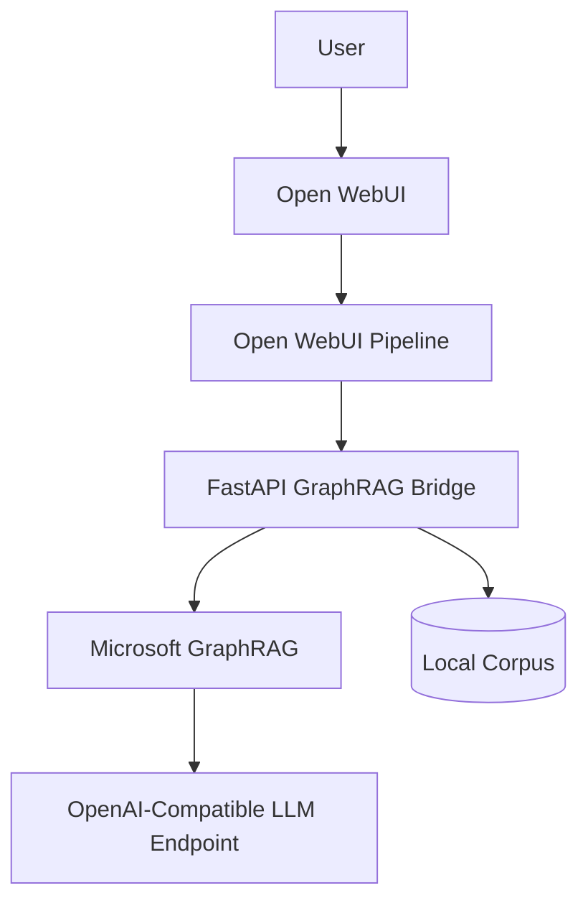

# grafrag-experimentation

Reference repository for experimenting with Microsoft GraphRAG behind Open WebUI, with a FastAPI bridge, external OpenAI-compatible LLMs, and deployment paths for Docker Compose and Kubernetes.

## Architecture

The repository separates user interaction, retrieval orchestration, and infrastructure concerns:

- Open WebUI provides the chat interface.
- An Open WebUI pipeline routes user prompts to the GraphRAG bridge.
- The FastAPI bridge normalizes requests, triggers GraphRAG CLI workflows when available, and adds a safe fallback path when no index exists yet.
- GraphRAG works on a local corpus under [`graphrag/input`](./graphrag/input) and writes artifacts to [`graphrag/output`](./graphrag/output).
- The final answer can be synthesized by any OpenAI-compatible endpoint through `SCW_LLM_BASE_URL`, `SCW_SECRET_KEY_LLM`, and `SCW_LLM_MODEL`.



## Request Flow

1. A user submits a prompt in Open WebUI.
2. The `graphrag_pipeline.py` pipeline sends the latest user message to the bridge.
3. The bridge attempts a GraphRAG CLI query against the indexed corpus.
4. If the CLI or index is unavailable, the bridge falls back to deterministic corpus retrieval so the system still answers safely.
5. When an external OpenAI-compatible endpoint is configured, the bridge asks that model to synthesize a final answer from the retrieved context.
6. The answer is returned to Open WebUI with citations to the local source files.
7. The bridge can also expose an interactive graph slice at `/graph`, and Open WebUI answers include a clickable link to that page.

The bridge must keep interactive chat responsive. In practice, this repository now applies a bounded request budget:

- `graphrag query` gets a shorter internal timeout
- fallback LLM synthesis gets its own shorter timeout
- if the remaining request budget is too low, the bridge returns a deterministic fallback answer instead of hanging

Open WebUI can also invoke the same pipeline for internal helper prompts such as follow-up question generation. Those prompts should not be sent through GraphRAG retrieval. The local pipeline therefore short-circuits known follow-up-generation prompts and returns lightweight JSON directly.

## Automation Model

Automation is split so local and cluster execution stay predictable:

- [`deploy/prepare-env.sh`](./deploy/prepare-env.sh) initializes local defaults.
- [`scripts/init_graphrag.sh`](./scripts/init_graphrag.sh) and [`scripts/index_corpus.sh`](./scripts/index_corpus.sh) prepare and index the corpus.
- [`deploy/build-images.sh`](./deploy/build-images.sh), [`deploy/push-images.sh`](./deploy/push-images.sh), and [`deploy/deploy-k8s.sh`](./deploy/deploy-k8s.sh) handle Kubernetes rollout.
- [`smoke-tests.sh`](./smoke-tests.sh), [`integration-tests.sh`](./integration-tests.sh), and [`penetration-tests.sh`](./penetration-tests.sh) cover health, functional behavior, and basic hardening checks.
- [`auto-fix-tests.sh`](./auto-fix-tests.sh) retries a narrow set of common misconfigurations and then re-runs the test suite.
- [`report.sh`](./report.sh) writes a Markdown report under `reports/`.

## Repository Layout

```text
grafrag-experimentation/
├── bridge/
├── cert-manager/
├── deploy/
├── graphrag/
├── k8s/
├── keycloak/
├── openwebui/
├── pipelines/
├── scripts/
└── tests/
```

## Local Docker

1. Create the local environment file:

   ```bash
   cp .env.example .env
   ```

2. Set `SCW_LLM_BASE_URL`, `SCW_SECRET_KEY_LLM`, and `SCW_LLM_MODEL`.

3. Start the stack:

   ```bash
   docker compose up -d --build
   ```

4. Index the sample corpus:

   ```bash
   ./scripts/index_corpus.sh
   ```

5. Generate a richer demo corpus from French Wikipedia and run an end-to-end retrieval check:

   ```bash
   python3 scripts/generate_medieval_wars_corpus.py --clean
   ./scripts/index_corpus.sh
   bash scripts/test_medieval_wars_flow.sh
   ```

6. Open:

- Open WebUI: `http://localhost:3000`
- Bridge API: `http://localhost:8081`
- Graph viewer: `http://localhost:8081/graph`
- Pipeline service: `http://localhost:9099`
- Keycloak in optional local SSO mode: `http://localhost:8082`

Exported shell variables take precedence over `.env`. If `printenv` already shows `SCW_SECRET_KEY_LLM`, `SCW_LLM_MODEL`, and `SCW_LLM_BASE_URL`, the local Docker and Kubernetes scripts will now reuse those values instead of overwriting them with placeholders from `.env`.

`BRIDGE_PUBLIC_URL` controls the clickable graph link emitted by the bridge and displayed in Open WebUI responses. For local Docker, keep `BRIDGE_PUBLIC_URL=http://localhost:8081`.

The GraphRAG Viewer now expects a valid Keycloak browser session. The HTML shell at `/graph` is public, but the actual graph data endpoints (`/graph/data` and `/graph/raw`) require a valid Keycloak bearer token. The page loads Keycloak automatically, checks the session for the `graphrag-viewer` client, and redirects to login when the session is missing or expired.

The browser-side graph rendering is powered by Cytoscape.js. The page attempts to load Cytoscape.js from a CDN with a second CDN fallback. If you run this repository in an air-gapped environment, vendor Cytoscape.js locally and update [`bridge/graph_view.html`](./bridge/graph_view.html) to point at the local asset instead.

In chronological mode, the viewer supports both vertical and horizontal timeline axes. The visual guide must stay visible in both orientations and remain synchronized with Cytoscape pan/zoom.

The initial graph framing and the recenter action both use the actually visible portion of the viewer inside the browser window, not just the full Cytoscape container height. This keeps the graph vertically centered even when part of the viewer is below the fold.

In horizontal chronological mode, the timeline guide is positioned relative to the visible browser viewport rather than the hidden bottom of the viewer container.

The `Axe chronologique` control is intentionally greyed out and disabled unless chronological view is the active reading mode.

The viewer also includes a synthesis workflow aimed at people who need to build a note from part of the corpus:

- the detail panel exposes actual GraphRAG text fragments coming from `text_units.parquet`
- fragments can be retained without reusing the source-group fill colors already used by the legend
- a `Synthèse en cours` basket keeps the retained excerpts and their sources visible
- the export area can download either the selected fragments or a Markdown prompt ready to replay in another LLM

Brand assets for the viewer live in [`bridge/assets`](./bridge/assets). The master image is [`bridge/assets/mirai-graphrag.png`](./bridge/assets/mirai-graphrag.png); regenerate the reduced PNGs, favicon, Apple touch icon, Android icons, and the dedicated Open WebUI model avatar (`mirai-model-avatar-128.png`) with `python3 scripts/generate_brand_assets.py`.

Open WebUI model aliases/overrides can carry their own image via `meta.profile_image_url`. This repository reprovisions:

- the two GraphRAG model entries (`graphrag-bridge.graphrag-local` and `graphrag-bridge.graphrag-global`)
- four general-purpose Scaleway chat models exposed through the `scaleway-general` pipeline manifold

using:

```bash
python3 scripts/provision_openwebui_model_aliases.py
```

The script deprovisions previous overrides, then recreates them in [`openwebui/data/webui.db`](./openwebui/data/webui.db) with:

- names `MirAI GraphRAG Local` and `MirAI GraphRAG Global`
- names `MirAI Chat GPT-OSS 120B`, `MirAI Chat Llama 3.3 70B`, `MirAI Chat Mistral Small 3.2`, and `MirAI Chat Qwen3 235B`
- a `profile_image_url` pointing to `${BRIDGE_PUBLIC_URL}/assets/mirai-model-avatar-128.png`
- short descriptive metadata and tags

In the default local configuration, Open WebUI hides the native login form and only exposes the Keycloak OIDC button. Start the optional SSO profile before using that button:

```bash
docker compose --profile sso up -d keycloak
docker compose restart openwebui
```

Important for local access from your Mac:

- `keycloak:8080` is only a Docker-internal hostname
- from the browser, use `http://localhost:8082`
- Open WebUI is configured to fetch OIDC metadata through `host.docker.internal:8082` so browser redirects stay host-accessible in local development
- local Keycloak test users are allowed to create their Open WebUI account through OIDC because `ENABLE_OAUTH_SIGNUP=true`
- when the same Keycloak e-mail logs in from another browser or session, `OAUTH_MERGE_ACCOUNTS_BY_EMAIL=true` must be enabled so Open WebUI links the OAuth identity to the existing account instead of trying to create a duplicate user

To enable local SSO, start the optional profile:

```bash
docker compose --profile sso up -d keycloak
```

## Kubernetes

The Kubernetes deployment expects:

- an ingress controller
- cert-manager
- Docker image push access to `REGISTRY`
- a namespace defined by `NAMESPACE`
- DNS records for `OPENWEBUI_HOST`, `KEYCLOAK_HOST`, and `SEARXNG_HOST`

Deploy the full stack:

```bash
./deploy/deploy-k8s.sh
```

The script renders manifests from [`k8s/base`](./k8s/base), creates secrets, imports the Keycloak realm, generates the pipelines ConfigMap directly from the local [`pipelines`](./pipelines) directory, waits for readiness, then launches smoke and integration checks.

The Kubernetes stack now also includes:

- `searxng` as a separate search deployment with configurable replicas
- `search-valkey` as the limiter/cache backend recommended by upstream SearXNG
- a dedicated ingress on `SEARXNG_HOST`
- a curated search profile that keeps major privacy-oriented engines first and keeps the rest intentionally constrained

SearXNG is configured to send outbound requests through three explicit proxy endpoints:

- `${SEARXNG_OUTBOUND_PROXY_PAR_URL}`
- `${SEARXNG_OUTBOUND_PROXY_AMS_URL}`
- `${SEARXNG_OUTBOUND_PROXY_WAW_URL}`

This is intentional. A single Scaleway Kapsule cluster is regional, so a clean multi-region egress design should not try to fake `three regions` with pods inside one cluster. Instead:

- keep the search pods in the cluster
- place three forward-proxy egress nodes outside the cluster, one in each target region
- point SearXNG at those three proxies, letting SearXNG distribute requests across them

The `k8s/base/configmap-searxng.yaml` profile favors privacy-oriented engines such as DuckDuckGo, Brave, Startpage, Qwant, and Mojeek. Bing stays available with a lower weight. Google is intentionally not enabled by default in this repository because it is both less privacy-friendly and more likely to trigger anti-bot countermeasures in self-hosted metasearch deployments.

For the `10 egress IPs per exit node` requirement, this repository deliberately amends the initial idea: on Scaleway Instances, a single VM can attach up to five flexible routed IPv4 addresses and up to five public IPv6 addresses. If you strictly need ten IPv4 addresses per region, use two proxy VMs per region or another regional egress pool instead of a single node.

GraphRAG itself only supports `file`, Azure Blob, and CosmosDB storage backends for cache. In this repository, Kubernetes therefore uses a pragmatic S3 sync layer:

- the live GraphRAG cache remains file-based inside the pod
- the cache directory is mounted on `/data/graphrag/cache` as a local pod volume
- the index job pulls cache objects from S3 before indexing and pushes them back after completion
- the bridge deployment pulls cache objects on startup and pushes them back during graceful shutdown

Set these variables when you want the Kubernetes cache sync enabled:

- `GRAPHRAG_CACHE_S3_ENABLED=true`
- `GRAPHRAG_CACHE_S3_BUCKET=...`
- `GRAPHRAG_CACHE_S3_PREFIX=graphrag/cache`
- `GRAPHRAG_CACHE_S3_ENDPOINT_URL=...`
- `GRAPHRAG_CACHE_S3_REGION=...`
- `GRAPHRAG_CACHE_S3_ACCESS_KEY_ID=...`
- `GRAPHRAG_CACHE_S3_SECRET_ACCESS_KEY=...`

For local Docker Compose, the GraphRAG cache now uses a dedicated named Docker volume mounted at `/app/graphrag/cache` instead of the repository working tree.

## cert-manager

The ClusterIssuer manifest lives in [`cert-manager/clusterissuer-letsencrypt.yaml`](./cert-manager/clusterissuer-letsencrypt.yaml). Replace `LETSENCRYPT_EMAIL` in `.env` before applying it.

## Keycloak

The realm definition is stored in [`keycloak/realm-openwebui.json`](./keycloak/realm-openwebui.json). It creates:

- realm `openwebui`
- client `openwebui`
- client `graphrag-viewer`
- users `user1` to `user10`
- `user` role for `user1` to `user9`
- `admin` role for `user10`

Default test credentials follow the prompt requirements: `userX@test.local` and password `userXpassword`.

## LLM Backends

The bridge expects an OpenAI-compatible chat endpoint and works with:

- Scaleway Generative APIs:
  `SCW_LLM_BASE_URL=https://api.scaleway.ai/a9158aac-8404-46ea-8bf5-1ca048cd6ab4/v1`,
  `SCW_LLM_MODEL=mistral-small-3.2-24b-instruct-2506`,
  `OPENAI_EMBEDDING_MODEL=bge-multilingual-gemma2`
- OpenAI: set `SCW_LLM_BASE_URL=https://api.openai.com/v1` and `SCW_LLM_MODEL` to your chat model identifier
- Azure OpenAI: set `SCW_LLM_BASE_URL` to the Azure OpenAI REST base URL ending with `/openai/deployments/<deployment>`
- vLLM: point `SCW_LLM_BASE_URL` to the local or remote `/v1` endpoint
- Internal gateway: any endpoint exposing OpenAI-compatible `chat/completions`

If the external model is unavailable, the bridge returns a deterministic answer built from the local corpus instead of failing with a blank response.

For the current local defaults, this repository is preconfigured for Scaleway chat plus multilingual embeddings. You still need to set `SCW_SECRET_KEY_LLM` in `.env` before live GraphRAG indexing can call the provider.

The bridge and deployment scripts keep compatibility with legacy `OPENAI_*` environment variables, but `SCW_*` is now the primary configuration surface for this repository.

Open WebUI itself still points to the `pipelines` service. The general-purpose Scaleway chat models are therefore exposed through a dedicated pipeline manifold instead of a second direct provider configuration inside Open WebUI. This keeps the architecture coherent: Open WebUI always talks to one OpenAI-compatible endpoint, while the `pipelines` layer decides whether a request goes to GraphRAG or to a direct Scaleway chat model.

## Secrets

This repository intentionally contains no real secrets.

- Local development uses `.env` copied from [`.env.example`](./.env.example).
- Kubernetes examples use [`k8s/base/secret.example.yaml`](./k8s/base/secret.example.yaml).
- Replace placeholder values such as `CHANGE_ME`, `EXAMPLE_ONLY`, and `REPLACE_ME` during deployment.

## Tests

Install local test dependencies:

```bash
python3 -m venv .venv
source .venv/bin/activate
pip install -r requirements-dev.txt
```

Run checks:

```bash
make smoke
make test
make security-test
make report
```

## Security Notes

- No production secrets are committed.
- The bridge avoids echoing raw credentials in `/config`.
- Kubernetes ingress manifests enforce TLS and add common security headers.
- Penetration tests cover basic port, endpoint, header, and trivial bypass checks.

## Operational Notes

- The bridge image includes GraphRAG CLI support but also degrades cleanly if the CLI behavior changes between releases.
- The sample corpus is intentionally small so local iteration stays fast.
- Persistent storage is minimal by default; extend the manifests before running production-scale indexing jobs.
- `GET /graph/data` serves a filtered JSON subgraph backed by `entities.parquet` and `relationships.parquet`.
- `GET /graph` serves a Cytoscape.js-based interactive viewer in French, styled with a DSFR-like visual direction.
- The viewer lets you edit the full current question directly in `Votre question`, and can reopen Open WebUI with that question prefilled through `?q=...` for immediate reuse.
- The detail panel can expose GraphRAG text fragments, the right panel keeps a `Synthèse en cours` basket, and the export area can download the retained fragments or a composite Markdown prompt for reuse in another LLM.
- The chronological guide works on both vertical and horizontal axes.
- The viewer centers the graph against the visible browser area, not only the full container box, and the recenter button reuses that same logic.
- The chronological axis selector is greyed out unless chronological mode is currently active.
- `GET /graph/raw` downloads the raw `graph.graphml` artifact if you still want to inspect it in Gephi or Cytoscape.
- The viewer enforces Keycloak-backed access for graph data and triggers a relogin when the Keycloak session has expired.
