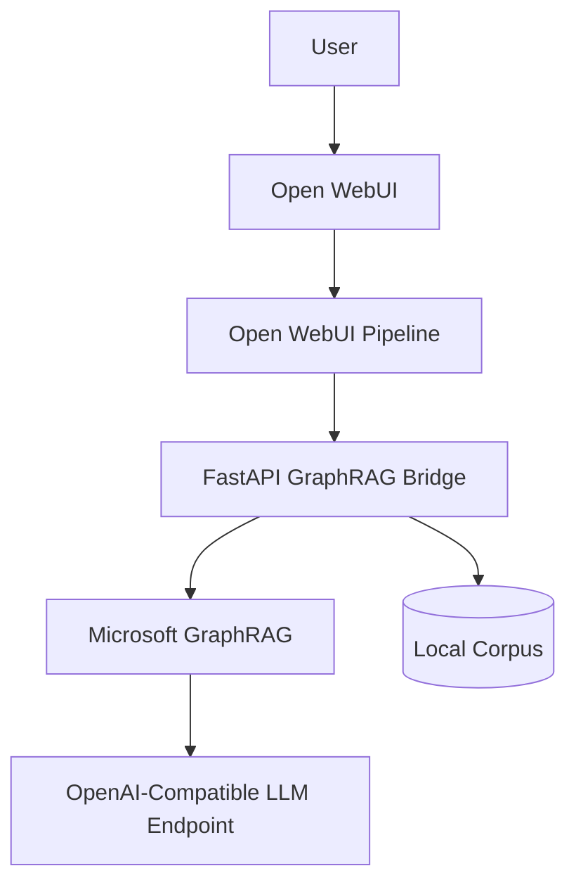

# grafrag-experimentation

Reference repository for experimenting with Microsoft GraphRAG behind Open WebUI, with a FastAPI bridge, external OpenAI-compatible LLMs, and deployment paths for Docker Compose and Kubernetes.

The repository now also includes a pragmatic multi-corpus control plane:

- a dedicated `Corpus Manager` web UI and API
- an asynchronous `corpus-worker` for sync and indexing jobs
- per-corpus, per-version GraphRAG workspaces
- a local `drive` mock service that behaves like a simple external collaborative file source for demo and testing

## Architecture

The repository separates user interaction, retrieval orchestration, and infrastructure concerns:

- Open WebUI provides the chat interface.
- An Open WebUI pipeline routes user prompts to the GraphRAG bridge.
- The FastAPI bridge normalizes requests, triggers GraphRAG CLI workflows when available, and adds a safe fallback path when no index exists yet.
- The Corpus Manager stores corpus metadata, sources, ACLs, versions, and job history in a dedicated metadata database.
- A background worker synchronizes source snapshots and builds GraphRAG artifacts outside the HTTP request path.
- GraphRAG works on a local corpus under [`graphrag/input`](./graphrag/input) and writes artifacts to [`graphrag/output`](./graphrag/output).
- The final answer can be synthesized by any OpenAI-compatible endpoint through `SCW_LLM_BASE_URL`, `SCW_SECRET_KEY_LLM`, and `SCW_LLM_MODEL`.



## Request Flow

1. A user submits a prompt in Open WebUI.
2. The `graphrag_pipeline.py` pipeline sends the latest user message to the bridge.
3. The bridge attempts a GraphRAG CLI query against the indexed corpus.
4. If the CLI or index is unavailable, the bridge falls back to deterministic corpus retrieval so the system still answers safely.
5. When an external OpenAI-compatible endpoint is configured, the bridge asks that model to synthesize a final answer from the retrieved context.
6. The answer is returned to Open WebUI with citations to the local source files.
7. The bridge can also expose an interactive graph slice at `/graph`, and Open WebUI answers include a clickable link to that page.
8. When full GraphRAG artifacts are missing, the viewer falls back to a document map built directly from the files under `graphrag/input` instead of failing closed.
9. For multi-corpus mode, the user selects an explicit published corpus and the bridge switches to the corresponding versioned GraphRAG workspace instead of querying a shared global index.

The bridge must keep interactive chat responsive. In practice, this repository now applies a bounded request budget:

- `graphrag query` gets a shorter internal timeout
- fallback LLM synthesis gets its own shorter timeout
- if the remaining request budget is too low, the bridge returns a deterministic fallback answer instead of hanging

Open WebUI can also invoke the same pipeline for internal helper prompts such as follow-up question generation. Those prompts should not be sent through GraphRAG retrieval. The local pipeline therefore short-circuits known follow-up-generation prompts and returns lightweight JSON directly.

## Automation Model

Automation is split so local and cluster execution stay predictable:

- [`deploy/prepare-env.sh`](./deploy/prepare-env.sh) initializes local defaults.
- [`scripts/init_graphrag.sh`](./scripts/init_graphrag.sh) and [`scripts/index_corpus.sh`](./scripts/index_corpus.sh) prepare and index the corpus.
- [`deploy/build-images.sh`](./deploy/build-images.sh), [`deploy/push-images.sh`](./deploy/push-images.sh), and [`deploy/deploy-k8s.sh`](./deploy/deploy-k8s.sh) handle Kubernetes rollout.
- [`smoke-tests.sh`](./smoke-tests.sh), [`integration-tests.sh`](./integration-tests.sh), and [`penetration-tests.sh`](./penetration-tests.sh) cover health, functional behavior, and basic hardening checks.
- [`auto-fix-tests.sh`](./auto-fix-tests.sh) retries a narrow set of common misconfigurations and then re-runs the test suite.
- [`report.sh`](./report.sh) writes a Markdown report under `reports/`.

## Repository Layout

```text
grafrag-experimentation/
├── bridge/
├── cert-manager/
├── deploy/
├── graphrag/
├── k8s/
├── keycloak/
├── openwebui/
├── pipelines/
├── scripts/
└── tests/
```

## Local Docker

1. Create the local environment file:

   ```bash
   cp .env.example .env
   ```

2. Set `SCW_LLM_BASE_URL`, `SCW_SECRET_KEY_LLM`, and `SCW_LLM_MODEL`.

3. Start the stack:

   ```bash
   docker compose up -d --build
   ```

4. Open the stack immediately:

- Open WebUI: `http://localhost:3000`
- Bridge API: `http://localhost:8081`
- Corpus Manager: `http://localhost:8084`
- Graph viewer: `http://localhost:8081/graph`
- Pipeline service: `http://localhost:9099`
- Keycloak in optional local SSO mode: `http://localhost:8082`
- Drive mock: `http://localhost:8085`

The graph viewer works at this stage in `document-map fallback` mode, built directly from `graphrag/input`, so local Docker no longer requires a prior GraphRAG indexing run just to make `mygraph` usable.

The multi-corpus MVP stores its runtime state under [`corpus-data`](./corpus-data), which is intentionally ignored by Git. That directory contains the metadata SQLite database, per-corpus version workspaces, and worker log files.

Local Docker now also starts these extra services by default:

- `corpus-manager` on port `8084`
- `corpus-worker` as the asynchronous job runner
- `drive` on port `8085`, exposing a demo workspace named `default`

To create a corpus from the local drive mock:

1. Open `http://localhost:8084`
2. Create a corpus with `source_kind=drive`
3. Use `base_url=http://drive:8070` and `workspace_id=default`
4. Run `Synchroniser`, then `Indexer la derniere version`, then `Publier`

Open WebUI keeps the same two GraphRAG models. In multi-corpus mode, pick the corpus explicitly in the prompt with:

```text
[[corpus:your-corpus-id]] your question here
```

The bridge then enforces corpus-level access control before querying the published version. The current Open WebUI integration surfaces indexing notices as synthetic messages added to GraphRAG responses, with deep links back to the Corpus Manager. It does not yet create native Open WebUI channels automatically.

5. Optionally index the sample corpus when you want the full GraphRAG entity/relationship graph plus `graphrag query`:

   ```bash
   ./scripts/index_corpus.sh
   ```

6. Generate a richer demo corpus from French Wikipedia and run an end-to-end retrieval check:

   ```bash
   python3 scripts/generate_medieval_wars_corpus.py --clean
   ./scripts/index_corpus.sh
   bash scripts/test_medieval_wars_flow.sh
   ```

To test the internet search module locally, start the dedicated profile:

```bash
docker compose --profile search up -d search-valkey searxng
docker compose up -d openwebui
bash scripts/test_local_search.sh
```

Direct local checks:

- SearXNG UI: `http://localhost:8083`
- JSON API example:

  ```bash
  curl -fsS --get "http://localhost:8083/search" \
    --data-urlencode "q=guerre de cent ans" \
    --data-urlencode "format=json"
  ```

The local Docker search profile is intentionally simpler than Kubernetes:

- it runs `searxng` plus `search-valkey`
- it exposes search on `SEARXNG_LOCAL_PORT` / `SEARXNG_LOCAL_BASE_URL`
- it uses direct egress by default for ease of local testing
- it keeps the SearXNG limiter disabled locally so direct `localhost` calls are not blocked by missing reverse-proxy IP headers
- the three regional egress proxies remain a Kubernetes-oriented architecture concern

Open WebUI is now preconfigured at deployment time to use SearXNG as its web search backend:

- `ENABLE_WEB_SEARCH=true`
- `WEB_SEARCH_ENGINE=searxng`
- `SEARXNG_QUERY_URL=http://searxng:8080/search` in local Docker
- `SEARXNG_QUERY_URL=http://searxng/search` in Kubernetes
- `WEB_SEARCH_RESULT_COUNT=5`
- `WEB_SEARCH_CONCURRENT_REQUESTS=3`

In local Docker, web search from Open WebUI only works when the `search` profile is running because the internal backend URL points to the `searxng` service on the Compose network.

Exported shell variables take precedence over `.env`. If `printenv` already shows `SCW_SECRET_KEY_LLM`, `SCW_LLM_MODEL`, and `SCW_LLM_BASE_URL`, the local Docker and Kubernetes scripts will now reuse those values instead of overwriting them with placeholders from `.env`.

`BRIDGE_PUBLIC_URL` controls the clickable graph link emitted by the bridge and displayed in Open WebUI responses. For local Docker, keep `BRIDGE_PUBLIC_URL=http://localhost:8081`.

The GraphRAG Viewer now expects a valid Keycloak browser session. The HTML shell at `/graph` is public, but the actual graph data endpoints (`/graph/data` and `/graph/raw`) require a valid Keycloak bearer token. The page loads Keycloak automatically, checks the session for the `graphrag-viewer` client, and redirects to login when the session is missing or expired.

When query-ready GraphRAG artifacts are present, the viewer serves the entity graph from `entities.parquet`, `relationships.parquet`, and the related outputs. When they are absent or temporarily unreadable, the same viewer falls back to a lighter document graph built directly from the corpus files. This keeps `mygraph` available in both Docker and Kubernetes before indexing has run.

The browser-side graph rendering is powered by Cytoscape.js. The page attempts to load Cytoscape.js from a CDN with a second CDN fallback. If you run this repository in an air-gapped environment, vendor Cytoscape.js locally and update [`bridge/graph_view.html`](./bridge/graph_view.html) to point at the local asset instead.

In chronological mode, the viewer supports both vertical and horizontal timeline axes. The visual guide must stay visible in both orientations and remain synchronized with Cytoscape pan/zoom.

The initial graph framing and the recenter action both use the actually visible portion of the viewer inside the browser window, not just the full Cytoscape container height. This keeps the graph vertically centered even when part of the viewer is below the fold.

In horizontal chronological mode, the timeline guide is positioned relative to the visible browser viewport rather than the hidden bottom of the viewer container.

The `Axe chronologique` control is intentionally greyed out and disabled unless chronological view is the active reading mode.

The viewer also includes a synthesis workflow aimed at people who need to build a note from part of the corpus:

- the detail panel exposes actual GraphRAG text fragments coming from `text_units.parquet`
- fragments can be retained without reusing the source-group fill colors already used by the legend
- a `Synthèse en cours` basket keeps the retained excerpts and their sources visible
- the export area can download either the selected fragments or a Markdown prompt ready to replay in another LLM

Brand assets for the viewer live in [`bridge/assets`](./bridge/assets). The master image is [`bridge/assets/mirai-graphrag.png`](./bridge/assets/mirai-graphrag.png); regenerate the reduced PNGs, favicon, Apple touch icon, Android icons, and the dedicated Open WebUI model avatar (`mirai-model-avatar-128.png`) with `python3 scripts/generate_brand_assets.py`.

Open WebUI model aliases/overrides can carry their own image via `meta.profile_image_url`. This repository reprovisions:

- the two GraphRAG model entries (`graphrag-bridge.graphrag-local` and `graphrag-bridge.graphrag-global`)
- four general-purpose Scaleway chat models exposed through the `scaleway-general` pipeline manifold

using:

```bash
python3 scripts/provision_openwebui_model_aliases.py
```

The script deprovisions previous overrides, then recreates them in [`openwebui/data/webui.db`](./openwebui/data/webui.db) with:

- names `MirAI GraphRAG Local` and `MirAI GraphRAG Global`
- names `MirAI Chat GPT-OSS 120B`, `MirAI Chat Llama 3.3 70B`, `MirAI Chat Mistral Small 3.2`, and `MirAI Chat Qwen3 235B`
- a `profile_image_url` pointing to `${BRIDGE_PUBLIC_URL}/assets/mirai-model-avatar-128.png`
- short descriptive metadata and tags

In local Docker, those overrides persist because [`openwebui/data`](./openwebui/data) is bind-mounted from the repository. In the current Kubernetes manifests, Open WebUI stores `/app/backend/data` on an `emptyDir`, so model overrides, MirAI avatars, and similar admin-side state disappear on pod recreation unless you either switch that mount to a PVC or rerun `python3 scripts/provision_openwebui_model_aliases.py` after each rollout. The current [`deploy/deploy-k8s.sh`](./deploy/deploy-k8s.sh) does not invoke that reprovisioning step automatically.

In the default local configuration, Open WebUI hides the native login form and only exposes the Keycloak OIDC button. Start the optional SSO profile before using that button:

```bash
docker compose --profile sso up -d keycloak
docker compose restart openwebui
```

Important for local access from your Mac:

- `keycloak:8080` is only a Docker-internal hostname
- from the browser, use `http://localhost:8082`
- Open WebUI is configured to fetch OIDC metadata through `host.docker.internal:8082` so browser redirects stay host-accessible in local development
- local Keycloak test users are allowed to create their Open WebUI account through OIDC because `ENABLE_OAUTH_SIGNUP=true`
- newly created OIDC users are activated directly as regular Open WebUI users because `DEFAULT_USER_ROLE=user`
- when the same Keycloak e-mail logs in from another browser or session, `OAUTH_MERGE_ACCOUNTS_BY_EMAIL=true` must be enabled so Open WebUI links the OAuth identity to the existing account instead of trying to create a duplicate user

To enable local SSO, start the optional profile:

```bash
docker compose --profile sso up -d keycloak
```

## Kubernetes

The Kubernetes deployment expects:

- an ingress controller
- cert-manager
- Docker image push access to `REGISTRY`
- a namespace defined by `NAMESPACE`
- DNS records for `OPENWEBUI_HOST`, `KEYCLOAK_HOST`, `SEARXNG_HOST`, and `CORPUS_MANAGER_HOST`

Deploy the full stack:

```bash
./deploy/deploy-k8s.sh
```

The script renders manifests from [`k8s/base`](./k8s/base), creates secrets, imports the Keycloak realm, generates the pipelines ConfigMap directly from the local [`pipelines`](./pipelines) directory, waits for readiness, then launches smoke and integration checks.

By default, the Kubernetes deploy no longer blocks on `job/graphrag-index`. `mygraph` is expected to stay usable through the document-map fallback, so the GraphRAG indexing job is now opt-in:

```bash
RUN_GRAPHRAG_INDEX_JOB=true ./deploy/deploy-k8s.sh
```

Keep `GRAPHRAG_INDEX_TIMEOUT_SECONDS=3600` when you do enable that job on Scaleway; the real GraphRAG CLI runtime on the cluster is longer than the earlier shorter defaults.

The Kubernetes stack now also includes:

- `corpus-manager` on its own ingress host
- `corpus-worker` as a dedicated background deployment
- a dedicated PVC for corpus metadata, version workspaces, and worker logs
- a simple `drive` mock deployment plus in-cluster service for end-to-end sync tests
- `searxng` as a separate search deployment with configurable replicas
- `search-valkey` as the Valkey limiter/cache backend recommended by upstream SearXNG
- a dedicated ingress on `SEARXNG_HOST`
- a curated search profile that keeps major privacy-oriented engines first and keeps the rest intentionally constrained

Open WebUI is also preconfigured in Kubernetes to use that in-cluster SearXNG service directly for web search through `http://searxng/search`, so the feature works immediately after deployment without additional manual setup in the admin UI.

The Kubernetes deployment also keeps OIDC onboarding usable out of the box: `ENABLE_OAUTH_SIGNUP=true` and `DEFAULT_USER_ROLE=user`, so a new user arriving from Keycloak is created directly as an active regular user instead of remaining in a `pending` state.

To smoke-test that module from a workstation without depending on public DNS, run:

```bash
bash scripts/test_k8s_web_search.sh
```

Useful overrides:

- `NAMESPACE=grafrag`
- `OPENWEBUI_DEPLOYMENT=openwebui`
- `SEARCH_QUERY="Open WebUI"`
- `MIN_RESULTS=1`
- `RUN_API_TEST=true` to exercise `POST /api/v1/retrieval/process/web/search` end to end
- `CHECK_SEARXNG_LOGS=true` to inspect `searxng` logs produced during the test window
- `FAIL_ON_ENGINE_REFUSAL=true` to make engine-side refusals such as CAPTCHA, `403`, or `429` fail the script
- `REQUIRE_API_TEST=true` to fail when no admin user is yet present in the Open WebUI database
- `RETRY_ATTEMPTS=3` and `RETRY_DELAY_SECONDS=10` if SearXNG rate limiting needs a slower retry cadence

The script execs into the `openwebui` deployment and, by default, validates the in-process Open WebUI web-search helper against the configured in-cluster SearXNG backend. It also inspects `searxng` pod logs from the start of the test and summarizes likely search-engine refusals by engine and category. When you also set `RUN_API_TEST=true`, it will try the authenticated retrieval API end to end and fall back to the helper only if no admin Open WebUI user exists yet.

SearXNG is configured to send outbound requests through three explicit proxy endpoints:

- `${SEARXNG_OUTBOUND_PROXY_PAR_URL}`
- `${SEARXNG_OUTBOUND_PROXY_AMS_URL}`
- `${SEARXNG_OUTBOUND_PROXY_WAW_URL}`

This is intentional. A single Scaleway Kapsule cluster is regional, so a clean multi-region egress design should not try to fake `three regions` with pods inside one cluster. Instead:

- keep the search pods in the cluster
- place three forward-proxy egress nodes outside the cluster, one in each target region
- point SearXNG at those three proxies, letting SearXNG distribute requests across them

The `k8s/base/configmap-searxng.yaml` profile favors privacy-oriented engines such as Brave, Startpage, Qwant, and Mojeek. Bing and Google are also enabled, but with lower weights so the ranking still favors the more privacy-oriented engines first. Google remains the least preferred of the enabled mainstream engines because it is more likely to trigger anti-bot countermeasures in self-hosted metasearch deployments.

For the `10 egress IPs per exit node` requirement, this repository deliberately amends the initial idea: on Scaleway Instances, a single VM can attach up to five flexible routed IPv4 addresses and up to five public IPv6 addresses. If you strictly need ten IPv4 addresses per region, use two proxy VMs per region or another regional egress pool instead of a single node.

GraphRAG itself only supports `file`, Azure Blob, and CosmosDB storage backends for cache. In this repository, Kubernetes therefore uses a pragmatic S3 sync layer:

- the live GraphRAG cache remains file-based inside the pod
- the cache directory is mounted on `/data/graphrag/cache` as a local pod volume
- the index job pulls cache objects from S3 before indexing and pushes them back after completion
- the bridge deployment pulls cache objects on startup and pushes them back during graceful shutdown

Set these variables when you want the Kubernetes cache sync enabled:

- `GRAPHRAG_CACHE_S3_ENABLED=true`
- `GRAPHRAG_CACHE_S3_BUCKET=...`
- `GRAPHRAG_CACHE_S3_PREFIX=graphrag/cache`
- `GRAPHRAG_CACHE_S3_ENDPOINT_URL=...`
- `GRAPHRAG_CACHE_S3_REGION=...`
- `GRAPHRAG_CACHE_S3_ACCESS_KEY_ID=...`
- `GRAPHRAG_CACHE_S3_SECRET_ACCESS_KEY=...`
- `GRAPHRAG_INDEX_TIMEOUT_SECONDS=3600` to give the GraphRAG CLI enough time to finish corpus indexing on Kubernetes

## Scaleway Notes

- Build the bridge image for `linux/amd64` on the current Scaleway Kubernetes nodes. The repository defaults `DOCKER_BUILD_PLATFORM` accordingly.
- Keep the graph viewer deployable without indexing. Full GraphRAG artifacts remain optional for richer graph exploration, not a prerequisite for bringing the stack up.
- Keep the corpus metadata and version workspaces on their dedicated PVC. The asynchronous worker and the bridge both depend on the same published corpus directories.
- Keycloak behind the ingress must advertise the public hostname and trust forwarded headers (`--hostname=${KEYCLOAK_HOST}` plus `--proxy-headers=xforwarded`), otherwise OIDC redirects and issuer metadata break externally.
- The current SearXNG profile intentionally excludes DuckDuckGo because it triggered repeated CAPTCHA failures in this deployment. The in-cluster backend also runs with `server.limiter: false` to avoid `429` on Open WebUI backend calls that do not look like browser traffic.
- MirAI model logos inside Open WebUI are not automatic on the current Scaleway rollout. They live in Open WebUI model overrides stored in `webui.db`, and the current Kubernetes deployment keeps `/app/backend/data` on `emptyDir`. Without a PVC or a post-deploy reprovision step, those avatars disappear after a rollout.
- Keep rotated Keycloak realm passwords outside Git-tracked realm files. Use the ignored local file `keycloak/realm-passwords.local.json` and render it into Kubernetes at deploy time.
- Keep manifest rendering on an explicit `envsubst` allowlist. Blindly substituting every `${...}` placeholder in generated configs caused accidental replacements in unrelated config blocks.

For local Docker Compose, the GraphRAG cache now uses a dedicated named Docker volume mounted at `/app/graphrag/cache` instead of the repository working tree.

## cert-manager

The ClusterIssuer manifest lives in [`cert-manager/clusterissuer-letsencrypt.yaml`](./cert-manager/clusterissuer-letsencrypt.yaml). Replace `LETSENCRYPT_EMAIL` in `.env` before applying it.

## Keycloak

The realm definition is stored in [`keycloak/realm-openwebui.json`](./keycloak/realm-openwebui.json). It creates:

- realm `openwebui`
- client `openwebui`
- client `graphrag-viewer`
- users `user1` to `user10`
- `user` role for `user1` to `user9`
- `admin` role for `user10`

Default test credentials follow the prompt requirements: `userX@test.local` and password `userXpassword`.

For Kubernetes password rotations, the deployment can also consume the ignored
local file `keycloak/realm-passwords.local.json` so rotated passwords do not
need to be committed to Git.

Do not bookmark or reuse Keycloak URLs under `.../login-actions/authenticate?...session_code=...`. They are one-shot URLs tied to a transient browser login flow. After a Keycloak restart or an expired tab, `invalid_code` on that URL does not by itself mean the OIDC configuration is broken.

## LLM Backends

The bridge expects an OpenAI-compatible chat endpoint and works with:

- Scaleway Generative APIs:
  `SCW_LLM_BASE_URL=https://api.scaleway.ai/a9158aac-8404-46ea-8bf5-1ca048cd6ab4/v1`,
  `SCW_LLM_MODEL=mistral-small-3.2-24b-instruct-2506`,
  `OPENAI_EMBEDDING_MODEL=bge-multilingual-gemma2`
- OpenAI: set `SCW_LLM_BASE_URL=https://api.openai.com/v1` and `SCW_LLM_MODEL` to your chat model identifier
- Azure OpenAI: set `SCW_LLM_BASE_URL` to the Azure OpenAI REST base URL ending with `/openai/deployments/<deployment>`
- vLLM: point `SCW_LLM_BASE_URL` to the local or remote `/v1` endpoint
- Internal gateway: any endpoint exposing OpenAI-compatible `chat/completions`

If the external model is unavailable, the bridge returns a deterministic answer built from the local corpus instead of failing with a blank response.

For the current local defaults, this repository is preconfigured for Scaleway chat plus multilingual embeddings. You still need to set `SCW_SECRET_KEY_LLM` in `.env` before live GraphRAG indexing can call the provider.

For a faster embedding profile on Scaleway, switch to:

- `SCW_LLM_MODEL=mistral-small-3.2-24b-instruct-2506`
- `OPENAI_EMBEDDING_MODEL=qwen3-embedding-8b`

The repository now infers `OPENAI_EMBEDDING_VECTOR_SIZE` from the embedding model when you leave it unset: `3584` for `bge-multilingual-gemma2` and `4096` for `qwen3-embedding-8b`. You can still override it explicitly when testing another provider or model family.

The bridge and deployment scripts keep compatibility with legacy `OPENAI_*` environment variables, but `SCW_*` is now the primary configuration surface for this repository.

Open WebUI itself still points to the `pipelines` service. The general-purpose Scaleway chat models are therefore exposed through a dedicated pipeline manifold instead of a second direct provider configuration inside Open WebUI. This keeps the architecture coherent: Open WebUI always talks to one OpenAI-compatible endpoint, while the `pipelines` layer decides whether a request goes to GraphRAG or to a direct Scaleway chat model.

## Secrets

This repository intentionally contains no real secrets.

- Local development uses `.env` copied from [`.env.example`](./.env.example).
- Kubernetes examples use [`k8s/base/secret.example.yaml`](./k8s/base/secret.example.yaml).
- Replace placeholder values such as `CHANGE_ME`, `EXAMPLE_ONLY`, and `REPLACE_ME` during deployment.

## Tests

Install local test dependencies:

```bash
python3 -m venv .venv
source .venv/bin/activate
pip install -r requirements-dev.txt
```

Run checks:

```bash
make smoke
make test
make security-test
make report
```

## Security Notes

- No production secrets are committed.
- The bridge avoids echoing raw credentials in `/config`.
- Kubernetes ingress manifests enforce TLS and add common security headers.
- Penetration tests cover basic port, endpoint, header, and trivial bypass checks.

## Operational Notes

- The bridge image includes GraphRAG CLI support but also degrades cleanly if the CLI behavior changes between releases.
- The sample corpus is intentionally small so local iteration stays fast.
- Persistent storage is minimal by default; extend the manifests before running production-scale indexing jobs.
- `GET /graph/data` serves a filtered JSON subgraph backed by `entities.parquet` and `relationships.parquet`.
- `GET /graph` serves a Cytoscape.js-based interactive viewer in French, styled with a DSFR-like visual direction.
- The viewer lets you edit the full current question directly in `Votre question`, and can reopen Open WebUI with that question prefilled through `?q=...` for immediate reuse.
- The detail panel can expose GraphRAG text fragments, the right panel keeps a `Synthèse en cours` basket, and the export area can download the retained fragments or a composite Markdown prompt for reuse in another LLM.
- The chronological guide works on both vertical and horizontal axes.
- The viewer centers the graph against the visible browser area, not only the full container box, and the recenter button reuses that same logic.
- The chronological axis selector is greyed out unless chronological mode is currently active.
- `GET /graph/raw` downloads the raw `graph.graphml` artifact when it exists, and otherwise returns a JSON export of the current document-map fallback.
- The viewer enforces Keycloak-backed access for graph data and triggers a relogin when the Keycloak session has expired.
